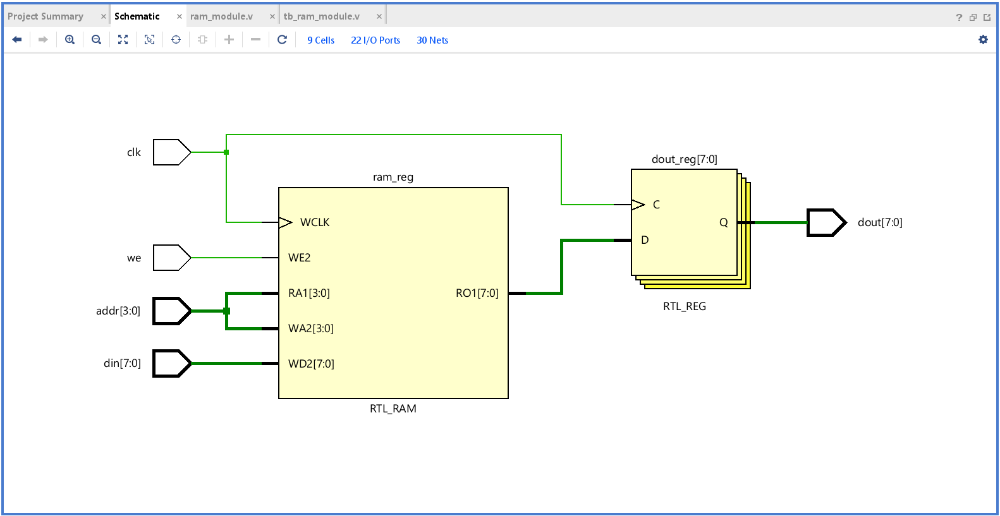
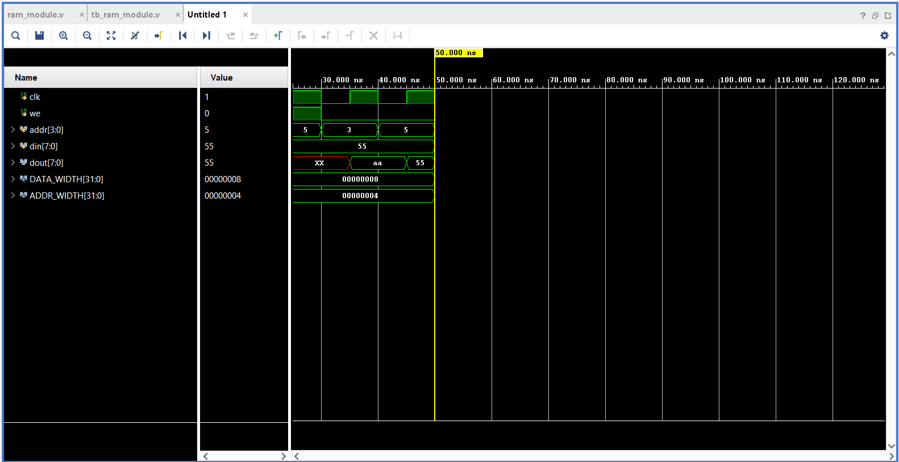

## 🔧 Step-by-Step Instructions

### 1. Project Setup in Vivado
- Open Vivado.
- Create a new RTL project (e.g., `RAM_Design_Project`).
- Skip adding sources at creation.
- Select your FPGA part (e.g., `xc7a35tcpg236-1` for Artix-7 on Basys 3).

### 2. Add Design and Testbench Files
- Add `ram_module.v` to the **Design Sources**.
- Add `tb_ram_module.v` to the **Simulation Sources**.

### 3. Run Simulation
- Go to **Flow Navigator → Simulation → Run Behavioral Simulation**.
- Observe waveforms to verify correct read/write operation of RAM.

## 🧪 Verilog Files

### ram_module.v
A parameterized synchronous RAM with read/write functionality.

### tb_ram_module.v
Testbench that:
- Writes values to RAM at different addresses.
- Reads back and displays the values.

## 🖼️ RTL Schematic

## 🖥️ Simulation Output

## ✅ Deliverables
- Verilog RAM code (`ram_module.v`)
- Testbench (`tb_ram_module.v`)
- Simulation showing functionality
- Images showing RTL schematic and waveform output
